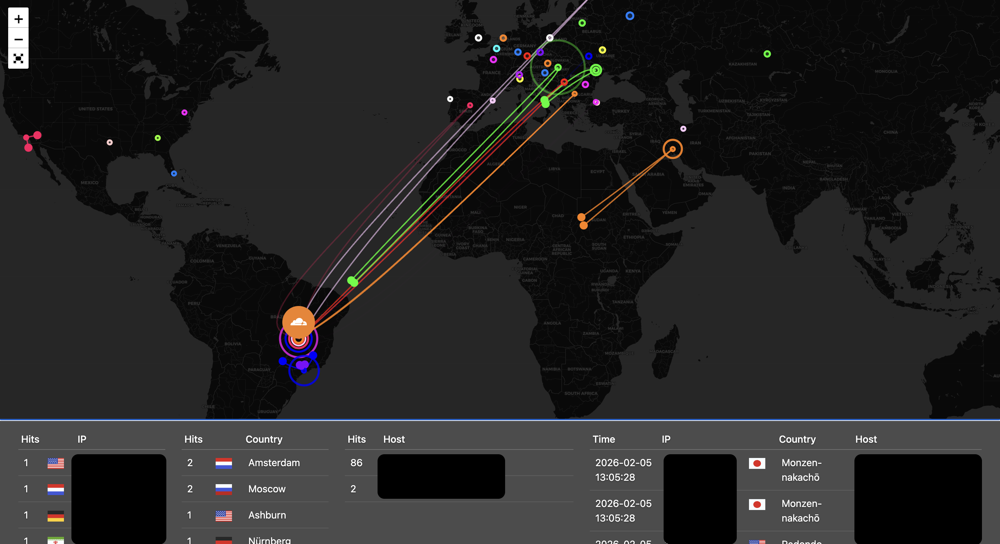

# Cloudflare Attack Map

Mapa de ataques em tempo real utilizando logs da Cloudflare.



## Requisitos

- Docker e Docker Compose
- Conta Cloudflare com plano Enterprise (necessário para Instant Logs)

## Configuração

```bash
cp .env.example .env
```

Edite o `.env`:

| Variável | Descrição | Obrigatório |
|----------|-----------|-------------|
| `CLOUDFLARE_API_TOKEN` | Token da API Cloudflare | Sim |
| `CLOUDFLARE_ZONE_NAMES` | Zonas separadas por vírgula | Não |
| `CLOUDFLARE_ACCOUNT_ID` | ID da conta Cloudflare | Não |

## Executar

```bash
docker compose up -d
```

Acesse: **http://localhost:8083**

